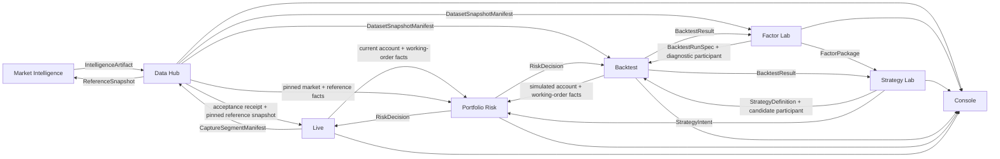
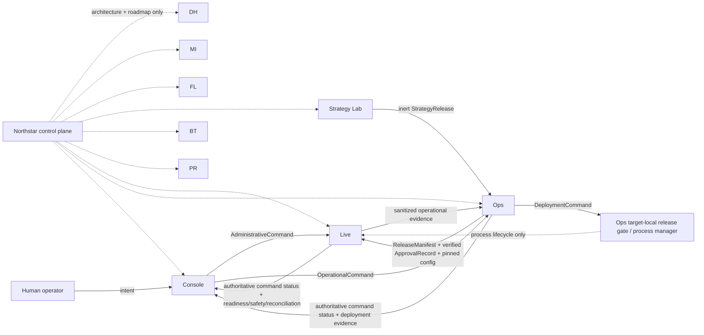
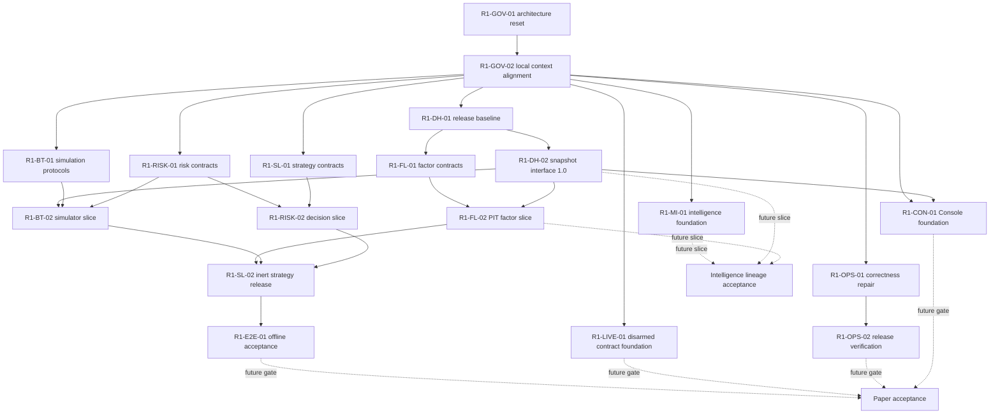

# Nine-repository architecture

Architecture revision: `NORTHSTAR-ARCH-R1`

Baseline: 2026-09-04

This revision replaces the former monolithic architecture and the copied
`ECOSYSTEM.md` rule that denied an umbrella repository. `northstar-quant` is the
implementation control plane, not a runtime domain. The nine repositories below
remain independent domain authorities.

## Design rules

Each repository is designed as a deep module: callers should learn a small,
versioned interface while domain logic and storage remain local. The producer
owns the meaning and schema of facts it publishes. Each consumer owns its
compatibility policy and adapter at the seam.

Cross-repository interaction uses one of two forms:

- an immutable, content-addressed artifact with producer release and schema
  version pins; or
- an authenticated network interface with explicit version, identity,
  idempotency, time, error, and freshness semantics.

There is no cross-repository source import, shared mutable database, implicit
`latest`, copying of a producer's private model, or independent redefinition of
producer semantics. A consumer may keep a wire model and compatibility adapter
at its boundary. A shared library is introduced only when at least two real
adapters prove a stable seam and one repository is named as its owner.

Repository-owned development, validation and control-plane entry points support
both macOS and Linux x86_64 unless an explicitly scoped runtime adapter documents
a narrower platform. An operating-system-specific binary is never the sole
official path for contract tests, local planning, or offline acceptance.

## Data and decision topology



## Governance and command topology



Arrows represent artifact or network-interface dependencies, not source-code
dependencies. Bidirectional runtime collaboration, such as Live/Ops or
Strategy/Backtest, is implemented through two separately owned interfaces; it
does not create a contract-publication cycle.

## Domain modules and owned interfaces

This table assigns target semantic ownership; it does not claim that an
interface has shipped. Verified implementation maturity is recorded separately
in [the repository map](REPOSITORY_MAP.md).

| Module | Interface it owns | Primary consumers |
| --- | --- | --- |
| Data Hub | `DatasetSnapshotManifest`, bounded snapshot member/export reads, reference snapshots, acceptance/publication receipts, quality and lineage evidence. | Factor Lab, Backtest, Strategy Lab, Portfolio Risk, Market Intelligence, Live and Console. |
| Market Intelligence | `DocumentManifest`, `EvidenceReference`, reviewed `IntelligenceArtifact`, local submission-attempt/outbox state. | Data Hub and Console. |
| Factor Lab | `FactorDefinition`, `FactorRunSpec`, evaluation/gate evidence, inert `FactorPackageManifest`. | Strategy Lab and Console. |
| Strategy Lab | `StrategyDefinition`, preregistered experiment evidence, inert `StrategyRelease`, account-neutral `StrategyIntent`. | Backtest, Portfolio Risk, Ops and Console; Live resolves only the exact release pinned by an Ops manifest. |
| Backtest | `BacktestRunSpec`, participant protocol, deterministic event/order/fill/account artifacts, `BacktestResult`. | Strategy Lab, Factor Lab and Console. |
| Portfolio Risk | `RiskPolicy`, normalized `RiskPortfolioStateInput`, `PortfolioProposal`, `RiskDecision`. | Backtest, Live, Strategy Lab and Console. |
| Live | `CaptureSegmentManifest`, account/readiness/safety/reconciliation state, `ReleaseVerificationState`, `ActivationState`, administrative command and authoritative command status. | Data Hub, Portfolio Risk, Ops and Console. |
| Ops | `ReleaseManifest`, verified `ApprovalRecord`, deployment/rollback/backup/restore plan and evidence, `DeploymentCommand` and authoritative command status. | Ops target-local adapters consume deployment commands; Live consumes manifests/verified approvals; Console consumes status/evidence. |
| Console | Browser-facing view models, operator-intent envelopes and non-authoritative command correlation. Provider-owned interfaces remain authoritative. | Human operators. |

## Critical seams

### Strategy, risk and execution

Research produces a release; a release does not produce the evidence that
qualifies itself. The authoritative research composition is:

```text
StrategyDefinition + content-addressed candidate participant
→ StrategyIntent

StrategyIntent
+ Backtest simulated account/position/working-order facts
+ pinned market/reference facts
+ pinned RiskPolicy
→ RiskPortfolioStateInput + evaluation request
→ PortfolioProposal
→ RiskDecision
→ Backtest SimulationCommand
→ BacktestResult + preregistered validation evidence
→ inert StrategyRelease
```

The later Live composition begins from a different gate:

```text
exact inert StrategyRelease
+ verified ReleaseManifest
+ valid, unexpired human ApprovalRecord
→ Live ReleaseVerificationState
→ explicit ActivationState

active StrategyIntent
+ current Live account/position/working-order facts
+ pinned market/reference facts
+ pinned RiskPolicy
→ PortfolioProposal
→ RiskDecision
+ all Live execution gates
→ Live OrderCommand
```

`StrategyIntent` is account-neutral and cannot contain order authority, account
lots, approval, or activation. Portfolio Risk exclusively owns allocation,
sizing, exposure and limit meaning. Backtest converts a valid, unexpired,
exactly bound historical decision into simulated commands; Live converts a
valid, unexpired, exactly bound current decision into broker-side commands.
Only `ALLOW`, or a machine-enforceable `REDUCE` that cannot increase risk, may
produce the corresponding command. `REJECT`, `UNKNOWN`, error or timeout
produces no new-risk command. A consumer may tighten or reject a decision but
never loosen it. Even `ALLOW` is necessary but never sufficient for Live
execution.

Backtest and Live each own their account facts. Their adapters translate those
facts into the Portfolio Risk-owned `RiskPortfolioStateInput`; neither imports
the other's private account type. Backtest owns simulated margin, settlement
and ledger conservation. Portfolio Risk owns pre-trade estimates, portfolio
limits and authorization outcomes. Both model versions are pinned in evidence.
Backtest may use `risk_policy: NONE` only for simulator-mechanics or factor
diagnostic tests; such a result is ineligible as StrategyRelease promotion
evidence.

### Intelligence and structured data

Market Intelligence owns claims, evidence, `IntelligenceArtifact` identity and
its local submission-attempt/outbox state. Data Hub exclusively owns reference
snapshots, ingestion-command envelopes, supported versions, idempotent receipt
rules, acceptance/publication receipts and canonical dataset publication. The
two repositories never co-own or co-evolve one submission contract. Data Hub
validates and normalizes an `IntelligenceArtifact` without reinterpreting its
claim. Market Intelligence never writes Data Hub storage or publishes directly
to Factor Lab, Strategy Lab, or Live.

The interface is established without a dependency cycle:

1. Market Intelligence publishes producer-owned artifact fixtures.
2. Data Hub publishes reference-snapshot and submission/receipt fixtures.
3. Each repository implements its adapter against the fixed fixtures.
4. A separate joint acceptance proves artifact-to-snapshot lineage.

### Operations, execution and presentation

The names describe distinct authority:

- Northstar is the implementation control plane.
- Ops is the deployment and operations module.
- Console is the human control surface.
- Live is the only broker side-effect authority.

| Plane | May do | Must never do |
| --- | --- | --- |
| Northstar | Define architecture, roadmap, Project state and acceptance policy. | Send runtime/deployment commands, approve or activate a release, access a broker. |
| Ops | Verify artifacts and human approvals; plan/execute deployment mechanics, process start/stop and rollback; retain operational evidence. | Manufacture an approval, arm/activate a strategy, submit or cancel a broker order, redefine provider health. |
| Console | Authenticate the browser session, collect operator intent, call a bounded provider command and correlate its returned status. | Be the authorization/audit authority, call a broker/SSH/database/artifact store directly, or expose a generic proxy. |
| Live | Authenticate, authorize and audit activation/safety/OMS commands; own account truth and every broker side effect. | Treat deployment, approval, Risk `ALLOW`, Project status or UI state as sufficient execution authority. |

Human authorization originates outside Ops and is bound into a signed or
otherwise verifiable `ApprovalRecord`; Ops verifies and transports it. Live is
the final authority for activate, arm, disarm, cancel and emergency-stop
commands. Initial Console work is read-only and cannot request any arm action.
Provider command results and audit evidence are authoritative; Console stores
only correlation identity and a rendered status.

Ops may verify and stage an exact Live release but cannot activate, arm, or
submit. Live publishes authoritative readiness, safety and reconciliation facts;
Ops retains only sanitized, immutable operational evidence or references without
becoming the query authority. Ops owns backup/restore mechanics and evidence;
each domain owner defines restored-data integrity and reconciliation predicates.
An Ops-owned target-local release gate/process-manager adapter handles
`DeploymentCommand`; the Live domain never implements that command. Process
start/stop is deployment mechanics, not Live activation or safety authority.

Before Live accepts any new-risk effect, the exact release manifest, unexpired
human approval and command envelope must be valid; Strategy, Risk and Data
identities must be pinned and active; the explicit execution mode must match;
the process must be armed under a current writer fence; broker, settlement and
reconciliation state must be healthy; account and feed observations must be
fresh; the applicable Risk decision must be current and bound; and the OMS
intent must already be durable and idempotent. Missing, stale, future, unknown,
mismatched or timed-out state blocks new risk. Restart, generation change and
trading-day rollover disarm. Deployment success, activation and arming are three
different states.

## Identity, time and compatibility

Every cross-repository artifact or command binds:

- `schema_version` and producer release identity;
- canonical content hash and immutable object identity;
- correlation, causation and idempotency identity where commands are involved;
- UTC event/decision/available/observed times appropriate to the domain;
- original source/exchange timezone and `trading_day` when market semantics
  require them; normalization to UTC never discards that context;
- exact upstream artifact identities and policy/model versions;
- a closed success/failure/unknown vocabulary.

Consumers fail closed on unknown major versions, hash drift, missing pins,
stale/future observations, incomplete pagination, ambiguous time, or incompatible
authority. Compatibility fixtures live with the consumer; canonical producer
fixtures live with the producer.

## Current-wave delivery dependency graph

The graph below governs publication order. It is deliberately acyclic even
where runtime calls are bidirectional.



Market Intelligence, Live and Console foundation nodes deliberately do not gate
`R1-E2E-01`; they feed the separately named future intelligence and Paper
acceptance themes. Dotted future nodes are not current Project items.

## Safety invariant

The first integrated target is a reproducible, offline, non-tradable research
slice. `R1-LIVE-01` may establish disarmed contracts in parallel but has no
broker effect. Paper acceptance follows only after offline evidence and the
Live, Ops and Console foundations exist. SimNow and production are separate
future gates. No artifact, Project status, test result, deployment, Paper run,
or SimNow run enables real-money behavior.
