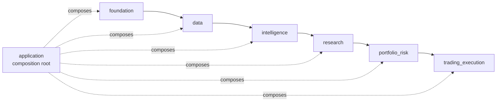
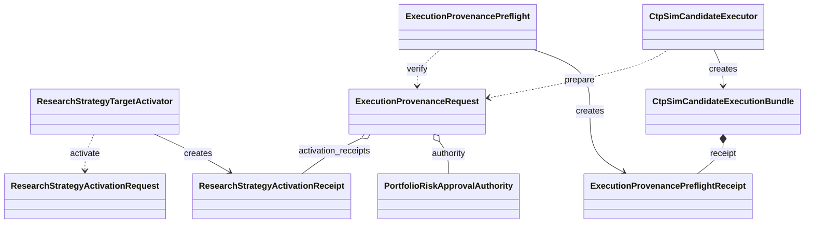
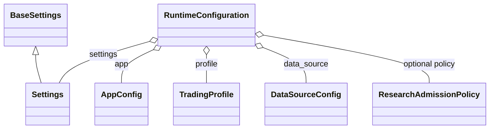
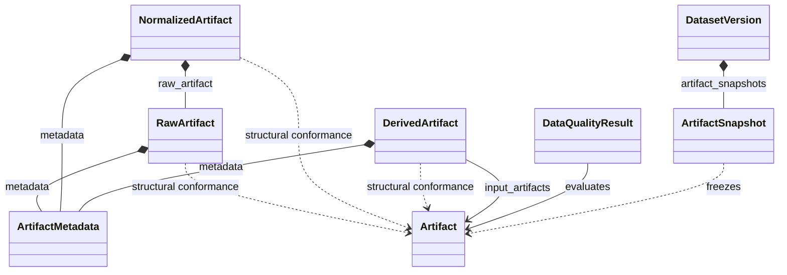
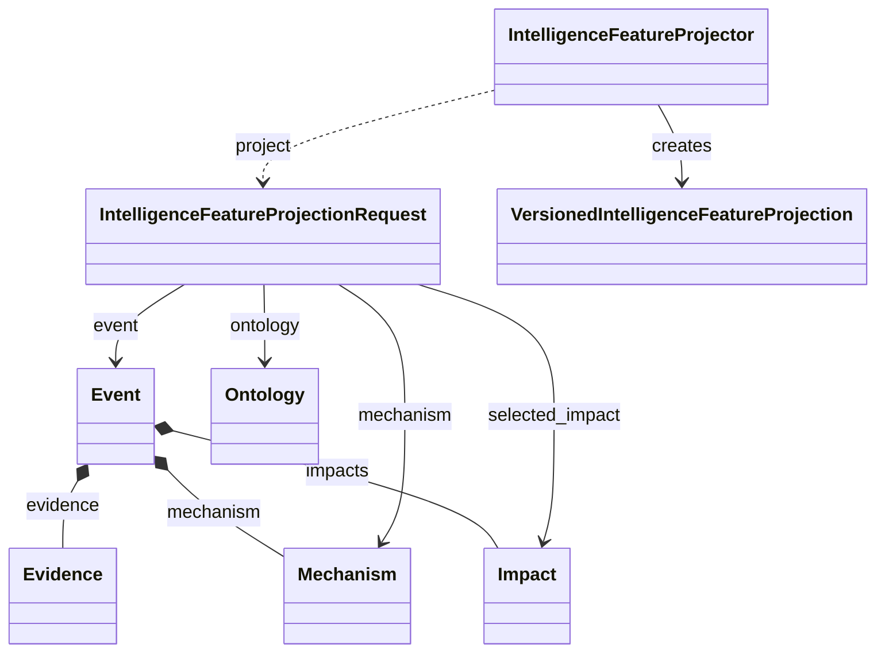
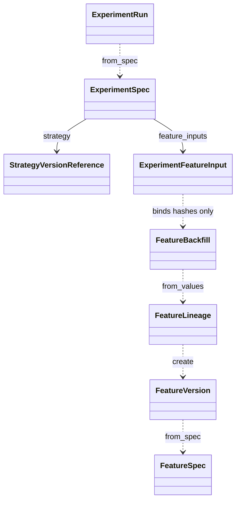
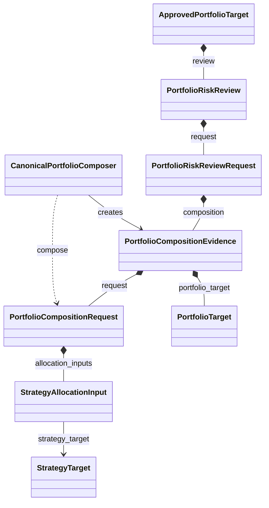
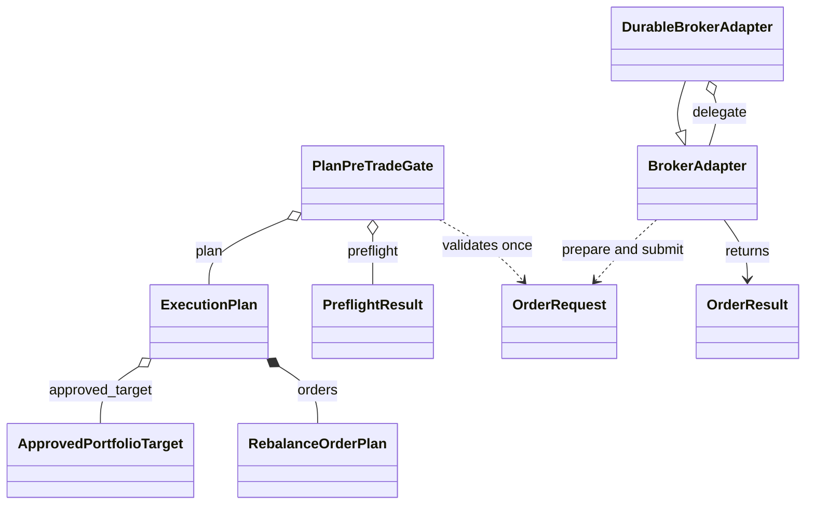

# Northstar Quant 架构设计

> 本文定义 Northstar Quant 的长期软件架构：模块职责、依赖方向、领域语义、证据流和安全控制边界。

## 1. 目的、状态与原则

Northstar Quant 是面向中国商品期货的量化研究、情报、组合、风险和交易平台。它是
**real-money-adjacent** 系统：即使在 offline、paper 或 `ctp_sim` 模式，也按未来真实资金系统的安全和可审计标准构建。

优先级固定为：Safety、Correctness、Data Integrity、Reproducibility、Architecture、Research Capability、
Production Reliability、Performance、UI。

安全默认值：

```text
NORTHSTAR_BROKER=paper
NORTHSTAR_LIVE_TRADING_ENABLED=false
```

市场数据、合约映射、日历、账户、持仓、未完成订单、风险、券商、报价新鲜度、保证金或数据授权任一状态未知时，
默认结论是 **NO NEW RISK**。系统不会用猜测、旧值或“估算可用”替代证据。

## 2. 系统拓扑与依赖规则



```text
src/northstar_quant/
├── application/        # 唯一跨领域 composition root
├── data/
├── intelligence/
├── research/
├── portfolio_risk/
├── trading_execution/
└── foundation/
```

`application/` 不是第七个业务领域；它只能组合稳定的领域契约，不承载领域模型。业务领域和 `foundation`
均不得反向导入 `application`。依赖只能从较高层使用较低层的稳定契约：

| 模块 | 可以依赖 | 禁止承担的职责 |
|---|---|---|
| `foundation` | 自身 | 任何业务领域语义 |
| `data` | `foundation` | 研究、风险、交易决策 |
| `intelligence` | `data`、`foundation` | 提交订单或生成 BUY/SELL |
| `research` | `intelligence`、`data`、`foundation` | 访问 broker 或升级生产策略 |
| `portfolio_risk` | `research`、`foundation` | 直接提交订单 |
| `trading_execution` | `portfolio_risk`、`foundation` | 策略研究逻辑 |
| `application` | 所有领域 | 反向成为领域依赖 |

### Application：跨领域 composition root



Application 只协调各领域已存在的契约：activation receipt、风险 authority 和 provenance request 被重放后，
`ExecutionProvenancePreflight` 只返回 eligibility 全为 false 的证据 receipt。`CtpSimCandidateExecutor` 只能从完整请求
准备隔离的 CTP-sim batch；它不是通用 broker client，也不能连接真实账户或提升任何 receipt 的交易资格。

`tests/architecture/` 强制检查无循环、无动态导入绕过、无反向业务依赖和公共 API 边界；失败时修复实现，不能删除测试。

## 3. 不可合并的领域语义

以下概念是不同的类型和状态机，禁止以临时字典或名称复用混淆：

```text
Document ≠ Event ≠ Feature ≠ Strategy
StrategyTarget ≠ PortfolioTarget ≠ ExecutionPlan ≠ BrokerOrder
Fill ≠ ClosedTrade
Commodity ≠ Instrument ≠ Contract
```

`ExecutionPlan` 只是可审计计划，永远不是订单；`Fill` 是外部成交事实，不能自行代表已平仓交易或收益结论。

## 4. 六个领域

以下每个领域说明后的“核心类型关系图”只展示该模块中最稳定、最能说明边界的关系，而不是把全部实现类、ORM
记录或私有 helper 画成难以维护的全量 UML。图中的类名可直接在 `src/northstar_quant/` 对应模块中找到；跨阶段协作
仍由 `application` 通过显式 hash、版本和 typed contract 完成。

图例：`*--` 表示对象字段或集合的拥有关系，`o--` 表示稳定绑定，`..>` 表示受控调用或协议依赖，
`<|--` 表示实现中的继承。虚线不会把数据或证据对象变成隐式可变共享状态。

### Foundation

Foundation 提供类型、时间、订单身份与状态、Pydantic 配置、PostgreSQL session/models/repositories、消息、调度、
可观测性、报告、安全、备份和部署基础。配置只接受 `NORTHSTAR_` 前缀，数据库 URL 必须是
`postgresql+psycopg://`；SQLite 不属于支持路径。

数据库是保全边界：迁移只前进，自动化不会删除、清空或截断 database、schema、table 或 Docker volume。
`init-db` 只执行 `alembic upgrade head`。模型、repository、Alembic migration、测试和文档必须一并变更。

#### 核心类型关系图



`RuntimeConfiguration` 是 Foundation 的受控组合根：它解析并验证运行设置、应用配置、交易画像、
数据源配置与可选研究准入策略。`DataSourceConfig` 留在 Foundation 是因为它是运行时受管配置，
不是 Data 领域发布的事实。消息总线、调度与 SQLAlchemy 记录是独立基础设施子图，不应混入此图而
伪装成领域对象拥有关系。

### Data

Data 发布受治理的事实，而不是策略或交易行为：

- source protocol、授权收据和 provider adapter；
- append-only raw / normalized artifact、内容 hash、fingerprint、lineage 与 `ArtifactSnapshot`；
- Contract Master、product/instrument/contract、规则快照、品种池和交易日历；
- 数据质量、版本、发布授权和 point-in-time（PIT）快照；
- 标准化市场数据及其可用时点。

所有研究数据需要明确 `event_time`、`source_time`、`published_time`、`ingested_time`、`processed_time` 和
`available_time`（按适用性取用）。回测只能消费：

```text
available_time <= simulation_time
```

修订后的数据不能覆盖历史状态；时间语义不明即标记 `UNKNOWN` 或失败关闭。

`Trading Calendar` 也是订单前事实，而不是工作日猜测。当前仓库配置中仅有 `test_only` 日历材料，
没有可运行的授权日历制品；任何将来可执行画像必须显式绑定
`futures.calendar_artifact_snapshot_hashes`。缺失时将以
`TRADING_CALENDAR_ARTIFACT_REQUIRED` 拒绝新订单。

#### 核心类型关系图



`RawArtifact`、`NormalizedArtifact` 与 `DerivedArtifact` 通过结构契约满足 `Artifact`，而不是名义继承它；
因此图中使用依赖虚线。`DatasetVersion` 只拥有不可变 `ArtifactSnapshot`，绝不直接持有可变制品；
质量、lineage 和 `available_at` 是版本可研究回放的前置事实。

### Intelligence

规范链为：

```text
Source → Document → Entity → Event → Mechanism → Impact → Market Context → Feature 定义
```

Document 是原始证据，Event 是经生命周期和多来源 merge 后的事实主张；两者必须分离。事件保留 evidence，
ontology 必须有版本；LLM 仅可提出受验证的结构化输出，不能作为 ground truth，也不能直接产生交易信号。

未授权 source、fixture 或 synthetic input 只能用于隔离测试；它们不能构造可交易的市场 `FeatureValue`、
真实合约、target、approval、plan 或订单。

#### 核心类型关系图



`Event` 保存可审计 evidence、mechanism 与 impact；`Document` 通过 evidence 的身份和内容 hash 被引用，
并非被 Event 直接拥有。投影请求在精确 ontology、event、selected impact、时间和授权市场上下文绑定后才可
生成 `VersionedIntelligenceFeatureProjection`，其输出始终 non-tradable，不能直接形成 target 或订单。

### Research & Strategy

Research 将受控事实转换为可复现实验：

```text
Feature → Experiment → Backtest → Validation → OOS / Stress → Research Decision
```

每次实验记录 DatasetVersion、FeatureVersion、StrategyVersion、配置、代码 revision、成本模型、滑点模型和 OOS 区间。
同一输入必须产生同一结果。单次 Sharpe、短样本盈利、漂亮连续合约或参数搜索结果都不足以升级策略。

Research 不依赖 broker。应用层的 `ResearchStrategyTargetActivator` 只重放具名人工 activation 审批、Research Card 和验证链，
产生含 `StrategyTargetActivationRef` 的 hash-bound、non-tradable `StrategyTarget` 收据；它没有订单、运行时或 broker 权限。

#### 核心类型关系图



Research 将 feature、lineage、backfill、strategy 和实验输入作为独立、hash-bound 的证据对象；
`ExperimentFeatureInput` 冻结 lineage/backfill hash，而不把可变回填对象嵌入实验。回测、验证、
Research Decision 与 Research Card 继续以显式输入/输出和 hash 连接，不能被本图误读为 broker 依赖或生产升级。

### Portfolio & Risk

Portfolio/Risk 合并多个 `StrategyTarget`，计算 allocation、exposure、limits、stress 和风险状态。规范组合器
`CanonicalPortfolioComposer` 产出 `PortfolioCompositionEvidence` 和 `PortfolioTarget v2`，并把策略集、allocation 与
净头寸的精确 hash 绑定。该输出不是批准，也不是可执行授权：

```text
eligible_for_execution=false
eligible_for_broker_order=false
```

组合审批必须以完整、未过期、同 scope 的市场/账户/风险/对账证据为条件。`UNKNOWN`、`WARN`、`BLOCK`、`HALT`、
人工恢复要求或 drift 任一存在时，均不得产生 approval、execution-provenance receipt、intent 或 broker mutation。认证的人类审批者与
最小权限数据库角色仍是外部前提；测试 issuer 不得成为生产接口。

#### 核心类型关系图



`StrategyTarget` 与 `PortfolioTarget` 都包含 `TargetPosition`，但前者属于单策略意图、后者是规范组合后的净目标。
`CanonicalPortfolioComposer` 只产生组合证据；`PortfolioRiskApprovalGate` 复核完整的风险输入并生成批准证据，
但不具备订单或 broker 提交能力。

### Trading & Execution

Trading/Execution 负责 execution plan、定价、router、paper / `ctp_sim` / CTP contract、持久化订单状态、
pre-trade gate、reconciliation、持仓、ledger 和 settlement。其强制链为：

```text
ApprovedPortfolioTarget
→ ExecutionPlan
→ PreTradeCheck
→ BrokerOrder
→ Fill
→ reconciliation / ledger / settlement
```

持久化 intent 必须在 broker 调用之前；callback 必须能处理 duplicate、out-of-order、reconnect、retry 和 idempotency。
未知订单、无法解释的成交或不一致账户状态导致 sticky `HALT`，且不能自动恢复。

`ctp_sim` 是本地、持久化的 CTP 语义模拟，不连接期货公司。`CtpSimCandidateExecutor` 是受控副作用边界：
它在锁内重验状态和报价，一次性消费 durable provenance，写入 intent 后才提交到隔离的 `ctp_sim`。它无法访问真实
CTP、Agent、CLI、scheduler、paper broker 或网络/进程面。真实 CTP front 在连接前拒绝
`CTP_REAL_FRONT_DISABLED`；这只是连接前的安全拒绝边界，不是适配器或集成完成声明。

#### 核心类型关系图



`ExecutionPlan`、`RebalanceOrderPlan`、`OrderRequest`、broker 返回结果和成交事实均不是同一类型。
`PlanPreTradeGate` 要求匹配计划与通过的 preflight，并且每个计划项只允许消费一次；
`DurableBrokerAdapter` 在调用底层适配器前增加持久化、幂等和租约边界。图中没有计划直达真实 CTP 的路径：
不透明的 CTP-sim authority 只存在于隔离模拟提交边界，真实 CTP front 仍在连接前失败关闭。

## 5. 跨领域证据流

### 数据与研究

```text
provider
→ immutable artifact + authorization + quality
→ DatasetVersion / PIT snapshot
→ FeatureVersion
→ Experiment / Backtest / Validation
→ Research Card
```

每一跳都必须可按 hash、版本和 `available_time` 重放。任何授权、质量、lineage、PIT 或契约映射缺失都会中断流转。

### 情报到研究

```text
Document evidence
→ Event lifecycle / merge
→ mechanism / impact / context
→ feature-definition projection
```

投影只提供窄化、静态、hash-bound 的研究输入；它不读取风险或交易路径，更不会直接形成 BUY/SELL。

### 研究到仿真候选执行

```text
Research Card + named activation
→ StrategyTarget
→ CanonicalPortfolioComposer
→ PortfolioTarget v2 / composition_hash
→ portfolio-wide risk evidence
→ app-bound manual approval
→ ExecutionProvenancePreflight
→ ctp_sim guarded plan / intent / order
→ callbacks / reconciliation / ledger / settlement
```

`ExecutionProvenancePreflight` 只是应用层纯验证器：它重放 activation、组合、风险和执行证据并返回所有 eligibility 都为 false 的
短时 receipt，不能 submit 或控制 broker。只有最终、opaque 的 `ctp_sim` authority 可以消费收据，且必须在每次副作用前
完成新鲜状态和报价检查。任何直写 synthetic target、手工 hash、过期 quote 或 scope 漂移都被拒绝。

## 6. AI 边界

AI 只能经封闭、typed 的 `TypedResearchToolApi` 访问 research-only 工具：它不可达 portfolio/risk/trading/live、
broker、配置、数据库、网络、进程或文件系统。Research、Intelligence 与 Data Quality Agent 的输出均为 non-tradable；
Ops Agent 只能读取单项 typed diagnostic snapshot。

`DurableResearchAgentRunner` 记录 hash-only 的 audit event 和 trace，用于可追溯性，但它不是 Agent tool，也不是控制路径。
不得持久化 raw prompt、chain-of-thought、原始查询、文档、结果、rationale 或异常 payload。Agent 无权 approve、
enable-live、resume-risk、submit 或连接 broker。

## 7. 配置、运行与部署边界

运行设置是显式、typed、validated 的：活动 `configs/app.yaml` 由示例生成，`configs/app.local.yaml` 和 `.env`
是本地私有覆盖；tracked 示例永远保持 paper / live-disabled。画像、source、研究准入、Contract Master、instrument、
calendar 和策略配置各有职责，不能以一个 YAML 暗中替代另一个。

生产目标仅 Linux x86_64；Windows/Linux 均为开发和部署控制端。可信部署路径是：

```text
Windows/Linux workstation
→ just / Python deployment controller
→ SSH stdin
→ Linux root-owned signed release gate
→ migrate → restart → health → promote
```

release gate 在 root-owned transaction 内验证签名、manifest、控制/运行 bundle 和固定入口。迁移开始后的失败只能人工恢复；
自动化不降级、不重试迁移、不绕过 health gate。systemd 服务采用 root-owned release/env snapshot、最小可写路径、
`ProtectSystem=strict` 和 loopback-only dashboard。备份、恢复演练和生产 DR 的详细操作及限制见[运行手册](OPERATIONS.md)。

## 8. 架构约束的执行

架构不是只靠文字维护。`tests/architecture/` 检查分层、循环、公共 API 和特殊候选执行 seam；领域 contract、integration、
simulation、golden、regression 与 failure tests 共同约束实现不得越过本文的依赖和安全边界。
